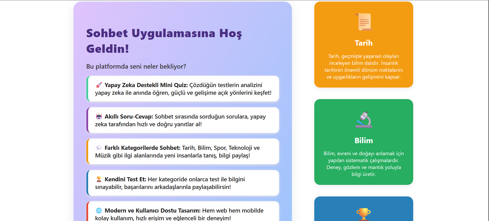
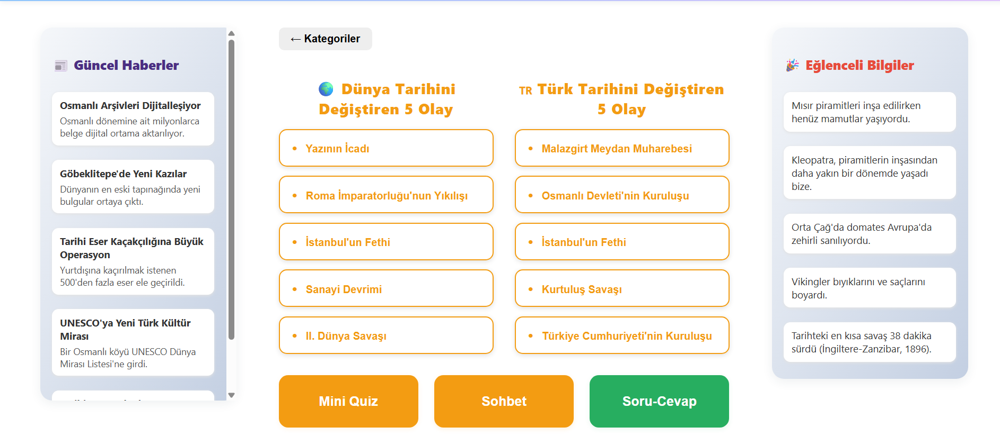
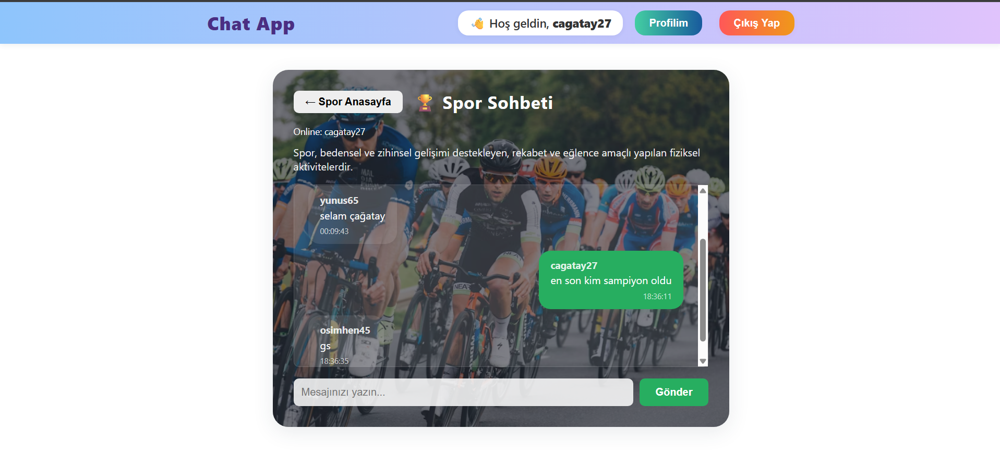
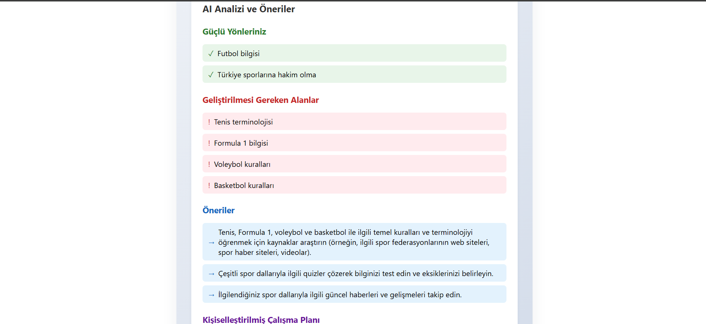
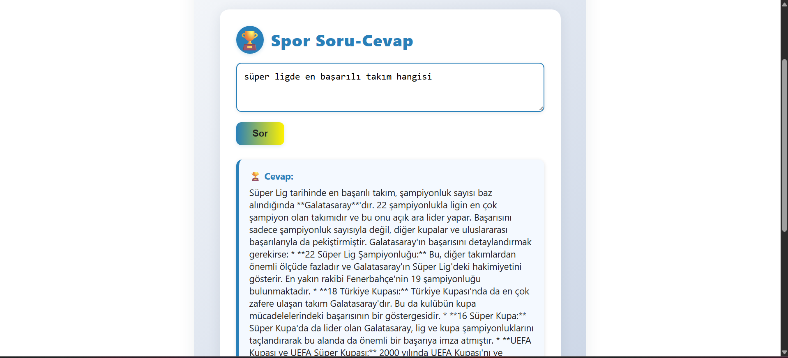

# SohbetAI

SohbetAI, yapay zekanın gücünü sohbet deneyimiyle harmanlayan, kullanıcılarına kişiselleştirilmiş bir öğrenme ve etkileşim platformu sunan yenilikçi bir uygulamadır.

## Ekran Görüntüleri

### Ana Sayfa ve Kategoriler

*Modern ve kullanıcı dostu ana sayfa tasarımı*


*Kategori bazlı sohbet odaları ve içerikler*

### Sohbet ve Quiz

*Gerçek zamanlı sohbet deneyimi ve yapay zeka asistanı*


*Etkileşimli quiz arayüzü ve anlık geri bildirim*

### Soru-Cevap Sistemi

*Yapay zeka destekli soru-cevap arayüzü*

## Yapay Zeka Destekli Kişisel Gelişim

Platformun en dikkat çekici özelliklerinden biri, yapay zeka destekli mini quiz sistemidir. Kullanıcılar çözdükleri her quiz sonrasında, yapay zeka tarafından hazırlanan detaylı bir analiz raporu alırlar. Bu raporda:
- Güçlü olduğunuz alanlar
- Geliştirilmesi gereken konular
- Kişiselleştirilmiş çalışma planı
- Motivasyonel mesajlar

bulunur. Yapay zeka, sadece doğru/yanlış sayısını değil, cevaplarınızı analiz ederek size özel bir gelişim yol haritası çizer.

## Akıllı Soru-Cevap Sistemi

SohbetAI'nin bir diğer öne çıkan özelliği, yapay zeka ile gerçek zamanlı sohbet imkanıdır. Kullanıcılar, herhangi bir konuda soru sorduklarında, yapay zeka:
- Anında ve doğru cevaplar verir
- Sohbet havasında, doğal bir diyalog kurar
- Soruları bağlamına göre yorumlar
- Gerekirse ek bilgiler ve kaynaklar sunar

Bu özellik sayesinde, kullanıcılar yapay zeka ile adeta bir arkadaşlarıyla sohbet eder gibi bilgi alışverişinde bulunabilirler.

## Kategorili Sohbet Odaları

Platform, Tarih, Bilim, Spor, Teknoloji ve Müzik gibi çeşitli kategorilerde sohbet odaları sunar. Her kategori:
- Kendine özgü bir tasarıma
- İlgili kategoride uzmanlaşmış yapay zeka desteğine
- Kategoriye özel quizlere
- O kategoriye ait güncel bilgi ve tartışmalara

sahiptir. Kullanıcılar, ilgi alanlarına göre kategoriler arasında geçiş yapabilir, hem diğer kullanıcılarla hem de yapay zeka ile etkileşime geçebilirler.

## Modern ve Kullanıcı Dostu Deneyim

SohbetAI, hem web hem de mobil platformlarda hizmet verir. Modern tasarımı ve kullanıcı dostu arayüzü sayesinde:
- Sezgisel navigasyon
- Akıcı sohbet deneyimi
- Gerçek zamanlı bildirimler
- Kişiselleştirilmiş içerik önerileri

sunar. Platform, kullanıcıların hem eğlenmesini hem de öğrenmesini sağlayan, sosyal etkileşim ve yapay zeka teknolojisini mükemmel şekilde harmanlayan bir deneyim sunar.

## Özellikler

### 🎯 Kişiselleştirilmiş Öğrenme Deneyimi
- Yapay zeka destekli kişisel gelişim planı
- Öğrenme stilinize göre uyarlanmış içerik
- İlerleme takibi ve performans analizi
- Hedef belirleme ve takip sistemi

### 🤖 Akıllı Sohbet Asistanı
- Doğal dil işleme ile gerçek zamanlı sohbet
- Bağlama duyarlı yanıtlar
- Çoklu dil desteği
- Bilgi kaynaklarına referanslar

### 🎮 Etkileşimli Quiz Sistemi
- Kategori bazlı özelleştirilmiş quizler
- Anlık geri bildirim
- Detaylı performans analizi
- Öğrenme önerileri

### 👥 Sosyal Öğrenme Platformu
- Kategori bazlı sohbet odaları
- Grup tartışmaları
- Uzman moderatörler
- Bilgi paylaşım platformu

### 📱 Çoklu Platform Desteği
- Web uygulaması
- Mobil uygulama (iOS/Android)
- Responsive tasarım
- Senkronize kullanıcı deneyimi

### 🔔 Akıllı Bildirim Sistemi
- Kişiselleştirilmiş içerik önerileri
- Öğrenme hatırlatıcıları
- Etkileşim bildirimleri
- Başarı bildirimleri

### 📊 Detaylı Analitik
- Öğrenme istatistikleri
- Performans grafikleri
- İlerleme raporları
- Başarı metrikleri

## Teknolojiler

### Frontend Teknolojileri
- **React.js**: Modern ve performanslı web arayüzü
- **React Native**: Cross-platform mobil uygulama geliştirme
- **Material-UI**: Hazır UI bileşenleri ve tema desteği
- **Redux**: Durum yönetimi
- **WebSocket**: Gerçek zamanlı iletişim
- **Axios**: HTTP istekleri yönetimi

### Backend Teknolojileri
- **Node.js**: Yüksek performanslı sunucu tarafı
- **Express.js**: Web uygulama framework'ü
- **MongoDB**: NoSQL veritabanı
- **Mongoose**: MongoDB nesne modelleme
- **JWT**: Güvenli kimlik doğrulama
- **Socket.io**: Gerçek zamanlı iletişim altyapısı

### Yapay Zeka ve Analitik
- **OpenAI API**: Doğal dil işleme ve sohbet
- **TensorFlow.js**: Makine öğrenmesi modelleri
- **Natural**: Metin analizi ve işleme
- **Chart.js**: Veri görselleştirme

### DevOps ve Araçlar
- **Docker**: Konteynerizasyon
- **Git**: Versiyon kontrolü
- **GitHub Actions**: CI/CD pipeline
- **ESLint**: Kod kalitesi kontrolü
- **Jest**: Test framework'ü
- **Postman**: API test ve dokümantasyon

### Güvenlik
- **bcrypt**: Şifre hashleme
- **helmet**: Güvenlik başlıkları
- **cors**: Cross-origin kaynak paylaşımı
- **rate-limiter**: API istek sınırlama

## Kurulum

### Gereksinimler
- Node.js (v14 veya üzeri)
- MongoDB (v4.4 veya üzeri)
- npm veya yarn
- Git
- React Native CLI (mobil geliştirme için)
- Android Studio (Android geliştirme için)
- Xcode (iOS geliştirme için, sadece macOS)

### Ortam Değişkenleri
Projeyi çalıştırmadan önce aşağıdaki ortam değişkenlerini ayarlamanız gerekiyor:

```env
# Backend
PORT=5000
MONGODB_URI=mongodb://localhost:27017/sohbetai
JWT_SECRET=your_jwt_secret
OPENAI_API_KEY=your_openai_api_key

# Frontend
REACT_APP_API_URL=http://localhost:5000
REACT_APP_WS_URL=ws://localhost:5000
```

### Backend Kurulumu
```bash
# Projeyi klonlayın
git clone https://github.com/yourusername/sohbetai.git
cd sohbetai/backend

# Bağımlılıkları yükleyin
npm install

# Veritabanını başlatın
mongod

# Uygulamayı başlatın
npm run dev
```

### Web Uygulaması Kurulumu
```bash
# Web dizinine geçin
cd ../web-js

# Bağımlılıkları yükleyin
npm install

# Uygulamayı başlatın
npm start
```

### Mobil Uygulama Kurulumu
```bash
# Mobil dizinine geçin
cd ../mobile

# Bağımlılıkları yükleyin
npm install

# iOS için (sadece macOS)
cd ios
pod install
cd ..

# Uygulamayı başlatın
# Android için
npm run android

# iOS için (sadece macOS)
npm run ios
```

### Docker ile Kurulum
```bash
# Tüm servisleri başlatmak için
docker-compose up -d

# Sadece backend için
docker-compose up backend

# Sadece web için
docker-compose up web

# Sadece mobil için
docker-compose up mobile
```

### Geliştirme Ortamı Kontrolü
Kurulumun başarılı olduğunu kontrol etmek için:

1. Backend: `http://localhost:5000/api/health` adresine GET isteği gönderin
2. Web: `http://localhost:3000` adresini tarayıcıda açın
3. Mobil: Emülatör veya gerçek cihazda uygulamayı başlatın

### Sorun Giderme
- Port çakışması durumunda `.env` dosyasından port numaralarını değiştirin
- MongoDB bağlantı hatası için MongoDB servisinin çalıştığından emin olun
- Node.js sürüm uyumsuzluğu için `nvm` kullanarak doğru sürüme geçin
- Bağımlılık hataları için `node_modules` klasörünü silip tekrar `npm install` yapın

## Kullanım

### Hesap İşlemleri
1. **Kayıt Olma**
   - "Kayıt Ol" butonuna tıklayın
   - E-posta adresinizi girin
   - Güçlü bir şifre belirleyin
   - İlgi alanlarınızı seçin
   - Kayıt formunu tamamlayın

2. **Giriş Yapma**
   - E-posta ve şifrenizi girin
   - "Beni Hatırla" seçeneğini işaretleyebilirsiniz
   - İki faktörlü doğrulama aktifse kodu girin

3. **Profil Yönetimi**
   - Profil fotoğrafı ekleyin
   - Kişisel bilgilerinizi güncelleyin
   - İlgi alanlarınızı düzenleyin
   - Bildirim tercihlerini ayarlayın

### Sohbet Odaları
1. **Kategori Seçimi**
   - Ana sayfadan bir kategori seçin
   - Popüler odaları görüntüleyin
   - Filtreleme seçeneklerini kullanın
   - Önerilen odalara göz atın

2. **Oda Katılımı**
   - Oda detaylarını inceleyin
   - Katılımcı listesini görüntüleyin
   - Oda kurallarını okuyun
   - "Katıl" butonuna tıklayın

3. **Sohbet Etkileşimi**
   - Mesaj gönderin
   - Emoji ve dosya paylaşın
   - Diğer kullanıcıları etiketleyin
   - Mesajları beğenin veya yanıtlayın

### Quiz Sistemi
1. **Quiz Seçimi**
   - Kategoriye özel quizleri görüntüleyin
   - Zorluk seviyesini belirleyin
   - Quiz açıklamasını okuyun
   - "Başla" butonuna tıklayın

2. **Quiz Çözme**
   - Soruları dikkatlice okuyun
   - Süreyi takip edin
   - Cevaplarınızı kontrol edin
   - Quiz'i tamamlayın

3. **Sonuç Analizi**
   - Performans raporunu inceleyin
   - Doğru/yanlış cevapları görüntüleyin
   - Önerileri okuyun
   - Gelişim planını takip edin

### Yapay Zeka Asistanı
1. **Soru Sorma**
   - Soru kutusunu kullanın
   - Bağlamı belirtin
   - Detayları ekleyin
   - Soruyu gönderin

2. **Yanıt İşleme**
   - Yanıtı okuyun
   - Ek bilgileri inceleyin
   - Kaynakları kontrol edin
   - Gerekirse takip sorusu sorun

3. **Öğrenme Takibi**
   - Öğrenme istatistiklerini görüntüleyin
   - İlerleme grafiklerini inceleyin
   - Önerileri değerlendirin
   - Hedefleri güncelleyin

### Bildirimler ve Ayarlar
1. **Bildirim Yönetimi**
   - Bildirim türlerini seçin
   - Sıklığı ayarlayın
   - Öncelikleri belirleyin
   - Sessiz saatleri ayarlayın

2. **Gizlilik Ayarları**
   - Profil görünürlüğünü ayarlayın
   - Veri paylaşımını yönetin
   - Hesap güvenliğini artırın
   - İzinleri düzenleyin

3. **Tema ve Görünüm**
   - Arayüz temasını seçin
   - Yazı tipini ayarlayın
   - Renk şemasını değiştirin
   - Görünüm tercihlerini kaydedin

## Katkıda Bulunma

### Başlangıç
1. Bu depoyu fork edin
2. Yeni bir branch oluşturun (`git checkout -b feature/amazing-feature`)
3. Değişikliklerinizi commit edin (`git commit -m 'Add some amazing feature'`)
4. Branch'inizi push edin (`git push origin feature/amazing-feature`)
5. Pull Request oluşturun

### Katkıda Bulunma Kuralları
1. **Kod Standartları**
   - ESLint kurallarına uyun
   - Prettier formatını kullanın
   - TypeScript tip tanımlamalarını ekleyin
   - JSDoc dokümantasyonu yazın

2. **Commit Mesajları**
   - Anlamlı ve açıklayıcı olun
   - Conventional Commits formatını kullanın
   - İlgili issue numarasını belirtin
   - Değişikliğin kapsamını açıklayın

3. **Pull Request Süreci**
   - PR açıklamasını detaylı yazın
   - İlgili issue'ları referans gösterin
   - Test sonuçlarını ekleyin
   - Screenshot veya demo ekleyin

4. **Test Gereksinimleri**
   - Unit testleri yazın
   - Integration testleri ekleyin
   - E2E testleri yapın
   - Test coverage'ı koruyun

### Geliştirme Ortamı
1. **Gerekli Araçlar**
   - Node.js ve npm
   - Git
   - VS Code (önerilen)
   - Docker (opsiyonel)

2. **Kurulum**
   ```bash
   # Geliştirme bağımlılıklarını yükleyin
   npm install

   # Lint kontrolü yapın
   npm run lint

   # Testleri çalıştırın
   npm test
   ```

3. **Kod İnceleme Süreci**
   - En az bir reviewer onayı gerekli
   - CI/CD pipeline'ı başarılı olmalı
   - Conflict'ler çözülmeli
   - Gerekli düzeltmeler yapılmalı

### Katkıda Bulunabilecek Alanlar
1. **Frontend**
   - UI/UX iyileştirmeleri
   - Performans optimizasyonları
   - Yeni özellikler
   - Hata düzeltmeleri

2. **Backend**
   - API geliştirmeleri
   - Veritabanı optimizasyonları
   - Güvenlik iyileştirmeleri
   - Yeni endpoint'ler

3. **Dokümantasyon**
   - README güncellemeleri
   - API dokümantasyonu
   - Kod yorumları
   - Wiki sayfaları

4. **Test ve Kalite**
   - Test coverage artırımı
   - Performans testleri
   - Güvenlik testleri
   - Kod kalitesi iyileştirmeleri

### İletişim
- GitHub Issues kullanın
- Discord kanalına katılın
- E-posta gönderin
- Weekly meeting'lere katılın

## Lisans

### MIT Lisansı
```
MIT License

Copyright (c) 2024 SohbetAI

Permission is hereby granted, free of charge, to any person obtaining a copy
of this software and associated documentation files (the "Software"), to deal
in the Software without restriction, including without limitation the rights
to use, copy, modify, merge, publish, distribute, sublicense, and/or sell
copies of the Software, and to permit persons to whom the Software is
furnished to do so, subject to the following conditions:

The above copyright notice and this permission notice shall be included in all
copies or substantial portions of the Software.

THE SOFTWARE IS PROVIDED "AS IS", WITHOUT WARRANTY OF ANY KIND, EXPRESS OR
IMPLIED, INCLUDING BUT NOT LIMITED TO THE WARRANTIES OF MERCHANTABILITY,
FITNESS FOR A PARTICULAR PURPOSE AND NONINFRINGEMENT. IN NO EVENT SHALL THE
AUTHORS OR COPYRIGHT HOLDERS BE LIABLE FOR ANY CLAIM, DAMAGES OR OTHER
LIABILITY, WHETHER IN AN ACTION OF CONTRACT, TORT OR OTHERWISE, ARISING FROM,
OUT OF OR IN CONNECTION WITH THE SOFTWARE OR THE USE OR OTHER DEALINGS IN THE
SOFTWARE.
```

### Lisans Kapsamı
- Tüm kaynak kodlar
- Dokümantasyon
- Örnekler ve şablonlar
- Yardımcı araçlar

### Lisans Dışı Öğeler
- Logo ve marka isimleri
- Üçüncü parti kütüphaneler
- API anahtarları
- Özel içerikler

### Kullanım Koşulları
1. **Ticari Kullanım**
   - Ticari projelerde kullanılabilir
   - Değişiklik yapılabilir
   - Dağıtılabilir
   - Özel kullanım yapılabilir

2. **Sorumluluk Reddi**
   - Yazılım "olduğu gibi" sunulur
   - Garanti verilmez
   - Sorumluluk kabul edilmez
   - Hasar riski kullanıcıya aittir

3. **Telif Hakkı**
   - Orijinal telif hakkı bildirimi korunmalı
   - Değişiklikler belirtilmeli
   - Katkıda bulunanlar listelenmeli
   - Lisans metni eklenmeli

### Üçüncü Parti Lisanslar
- React.js: MIT License
- Node.js: MIT License
- MongoDB: Server Side Public License
- OpenAI API: OpenAI Terms of Service

### Lisans Değişiklikleri
- Gelecekteki sürümlerde lisans değişebilir
- Değişiklikler önceden duyurulur
- Mevcut sürümler etkilenmez
- Katkıda bulunanlar bilgilendirilir

---

Projeyi beğendiyseniz yıldız vermeyi unutmayın! 🌟